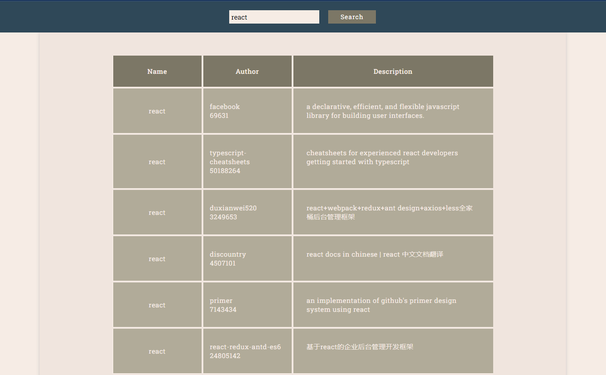

# Fetch Repositories by topic (Git)

### [Deploy link](https://istiniel.github.io/comments-nativeJS)

### Native JS + SCSS

:star: Ищите интересующие вас репозитории\
:star: Возможность указать тему\
:star: Как на компьютерах, так и на мобильных устройствах\



### Пример используемого в данном приложении кода (JS native)

```js
// delete validation tooltips when filling the input
for (const input of fetchReposForm.elements) {
  input.addEventListener('input', (e) => {
    // delete all red outlines
    for (const input of fetchReposForm.elements) {
      input.classList.remove('invalid');

      // delete all tooltips
      let label = input.parentElement;
      label.dataset.tooltip = '';
    }
  });
}
```

### Пример используемого в данном приложении кода (SCSS)

```scss
$breakpoints: (
  xSmall: $break-xs,
  small: $break-sm,
  medium: $break-md,
  large: $break-lg,
  xLarge: $break-xl,
);

// max-width
@mixin maxQ($key) {
  $size: map.get($breakpoints, $key);

  @media (max-width: $size) {
    @content;
  }
}
```
